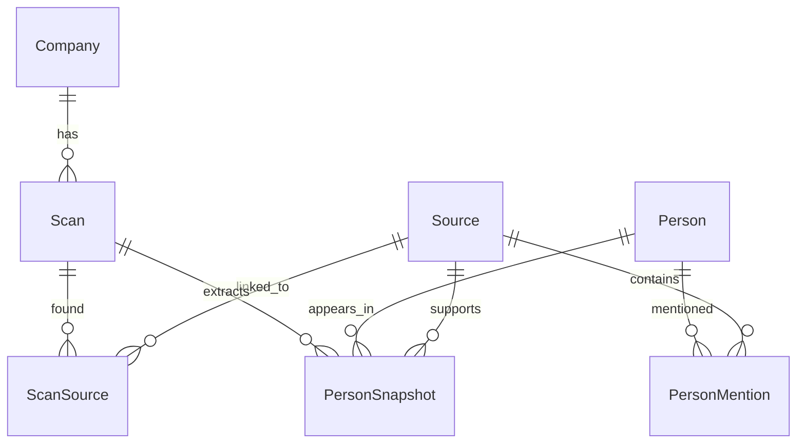

# Database Schema

This document describes the domain relationships behind weekly company scans,
canonical sources, people, and scan snapshots.

It intentionally avoids listing every model field. Model fields are still
evolving during development, so Django models remain the source of truth for
exact columns.

## Ownership

- `companies` owns monitored companies.
- `scans` owns scan runs and facts extracted during a scan.
- `sources` owns canonical source documents, deduplicated by content hash.
- `persons` owns canonical people and their source mentions.

`PersonSnapshot` belongs in `scans` because it is not a permanent person
attribute. It is the scanner's extracted view of a person's role at a company
for one specific scan.

## Entity Relationship Diagram



## Model Roles

### Company

The company being monitored. A company can have many weekly scans.

### Scan

One scan run for a company. It groups the sources discovered during that run
and the person snapshots extracted from those sources.

### Source

A canonical source document discovered by scans.

`Source` is independent from `Scan`. If the same content is found in multiple
weekly scans, the same source row is reused and linked to each scan through
`ScanSource`.

### ScanSource

The link between a scan and a source found during that scan.

This exists because one source can be found in many scans, and one scan can
find many sources.

### Person

A canonical person identity shared across scans and sources.

### PersonMention

The evidence-level link between a person and a source.

A mention means the person appeared in a source. It does not necessarily mean
the person currently works for the scanned company.

Mentions drive the person side of the app: reading a person's mentions over
time reconstructs their movement across sources, independently of any single
company scan.

### PersonSnapshot

The scanner's extracted view of a person's role for one scan.

This is scan-level state. It answers:

```text
During this scan, what did we conclude about this person and their role at this
company?
```

Snapshots drive the company side of the app: navigating a company's scans shows
what each scan concluded at that point in time.

## Scan Flow

Expected write flow for a weekly scan:

1. Create a scan for the company.
2. Fetch and parse company pages.
3. For each parsed page, compute a content hash.
4. Get or create a canonical source by content hash.
5. Link the source to the scan through `ScanSource`.
6. Extract people from each source.
7. Get or create canonical people by normalized name.
8. Link people to sources through `PersonMention`.
9. Create or update scan-level person facts through `PersonSnapshot`.

The source can be reused across many scans, while each scan still records that
it found the source through `ScanSource`.

## Report Paths

Company report:

```text
latest completed Scan for Company
-> Scan.person_snapshots
-> PersonSnapshot.person
-> PersonSnapshot.source
```

Person history report:

The person side tracks a person's movement over time through mentions, not
through scan snapshots. `PersonSnapshot` is scan-level company state, while
`PersonMention` is the person's own evidence trail across sources.

```text
Person
-> Person.source_mentions ordered by mention timestamp
-> PersonMention.source
-> Source.scan_links -> ScanSource.scan.company
```

Source evidence report:

```text
Source
-> Source.person_mentions
-> Source.scan_links
-> Source.person_snapshots
```
